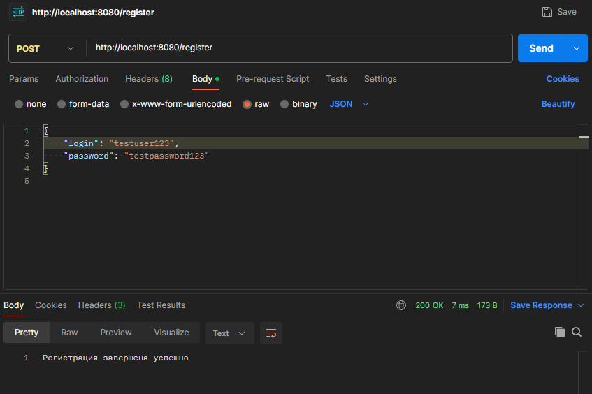
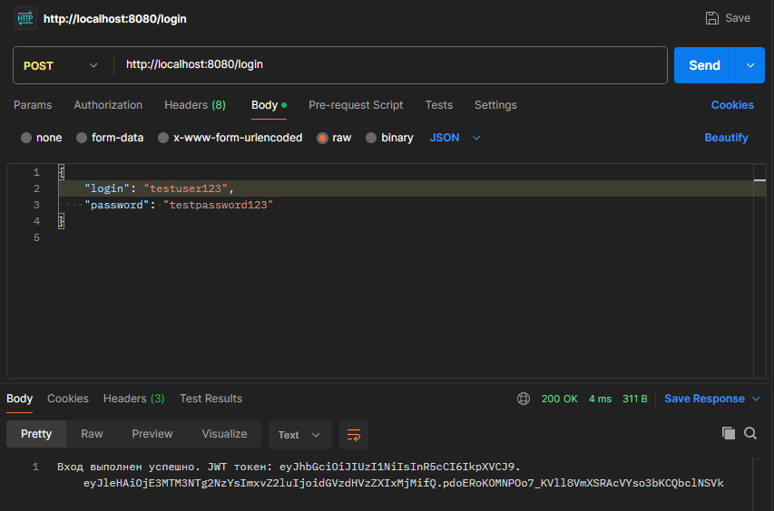
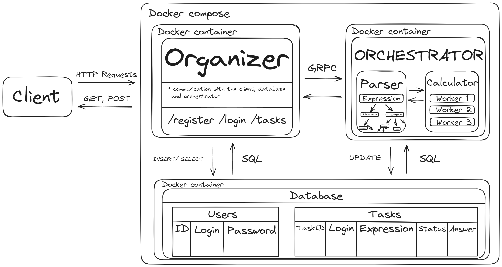

# DCServerYandex
 # Yandex Lyceum - Final Project - Distributed Computing Server
 

## Требования: Docker (желательно Desktop), Go, Postman

## Запуск: 
 1. Запуск сервисов (органайзер и оркестратор) и базы данных в Docker-контейнерах:
    
     ```bash
     docker-compose up --build
    ```
 2. Инициализация базы данных (перед этим переходим в директорию db_init):
    
    ```bash
     go run main.go
    ```
## Готово! Если у вас есть Docker Desktop, вы можете увидеть запущенные контейнеры:


# Синтаксис запросов (на примере Postman):
## Регистрация нового пользователя в БД (/register):
### Метод POST; Body выбираем raw:
```bash
{
    "login": "testuser123",
    "password": "testpassword123"
}
```

## Вход пользователя в систему и получение JWT-токена сроком на час (/login):
### Метод POST
```bash
{
    "login": "testuser123",
    "password": "testpassword123"
}
```


# Как это все работает?


# Поддержка:
## Если что-то не получается, всегда готов помочь :)
## tg: @rielexx discord: darklexx_
# Ожидаемая оценка: 50 баллов.
